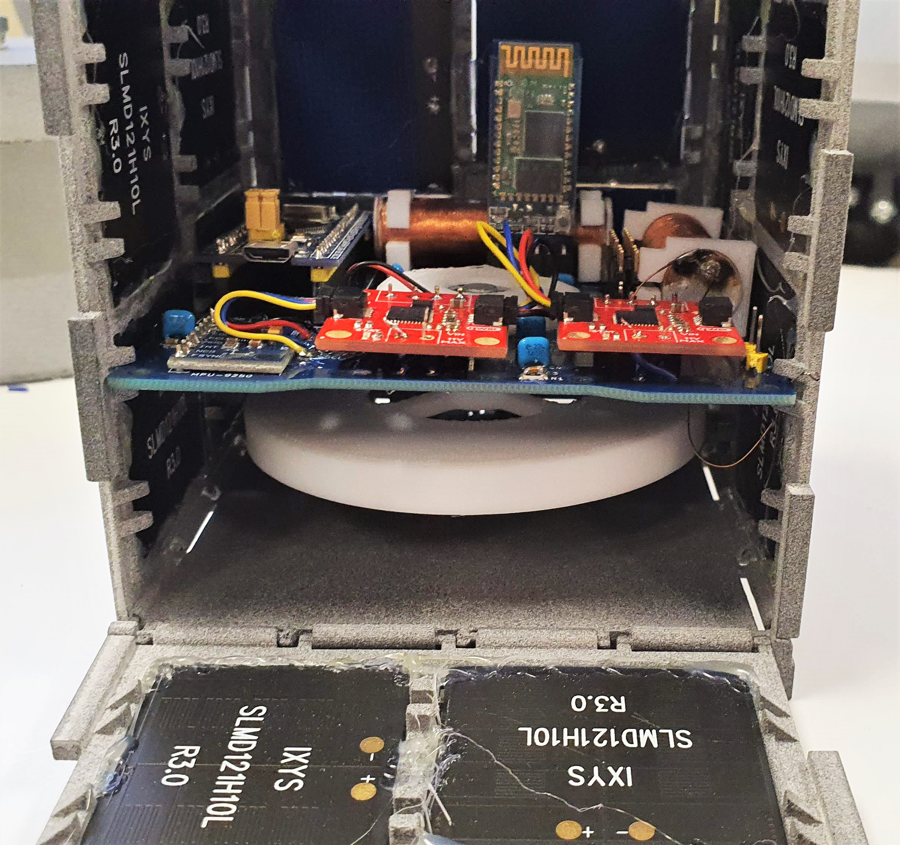
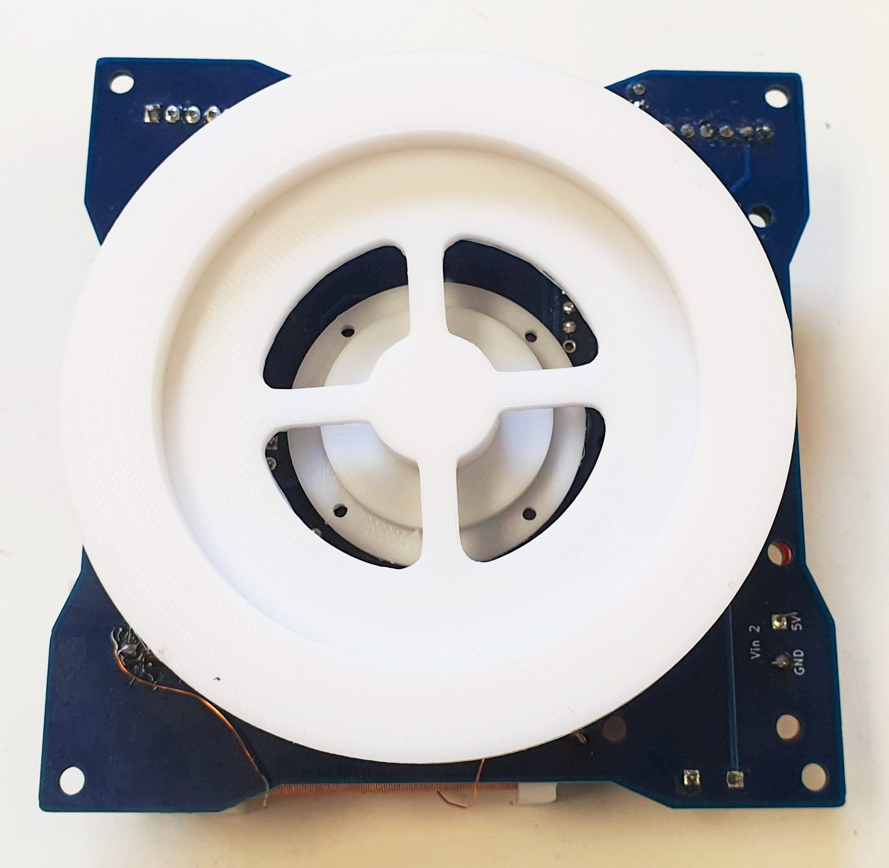
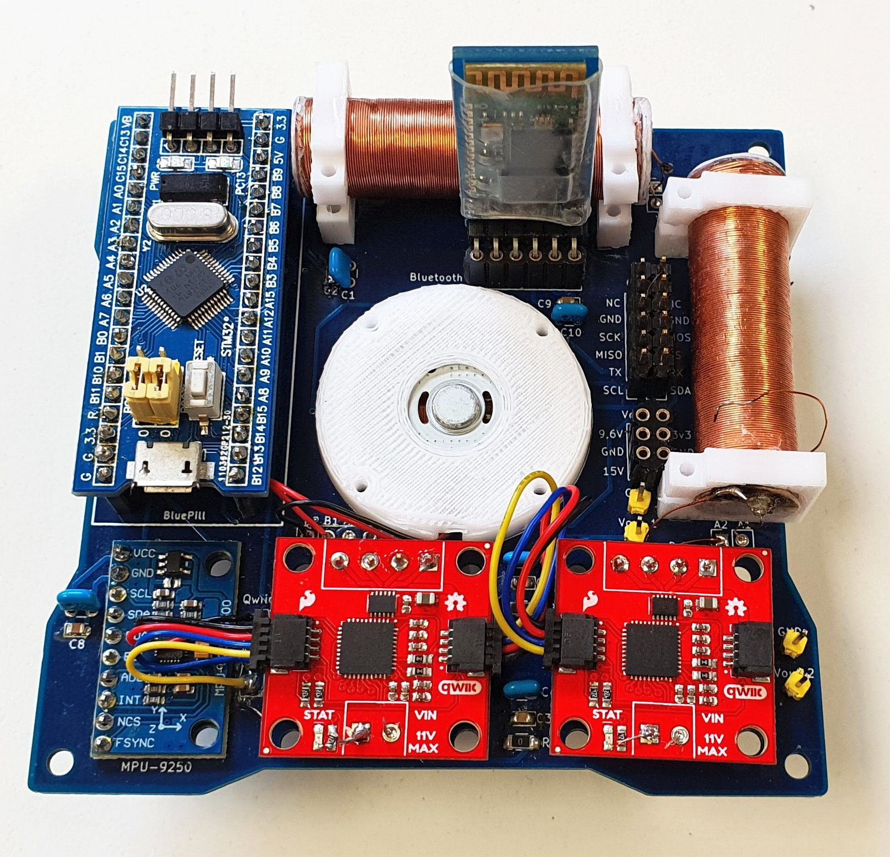
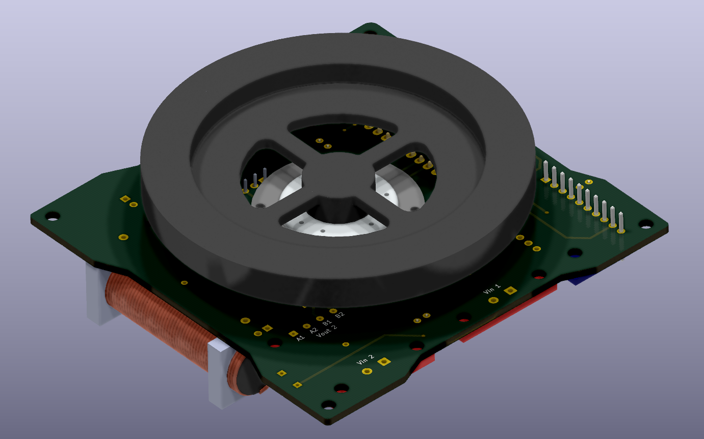
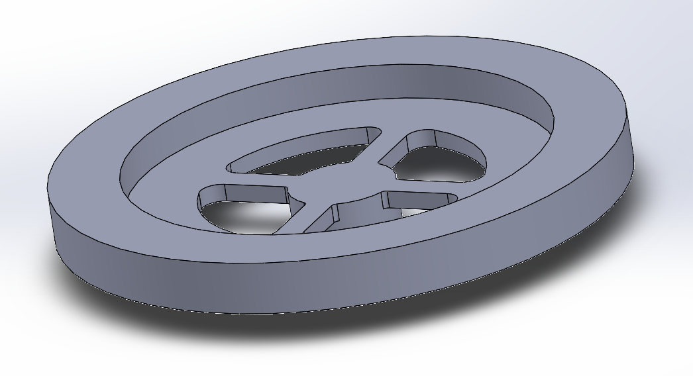
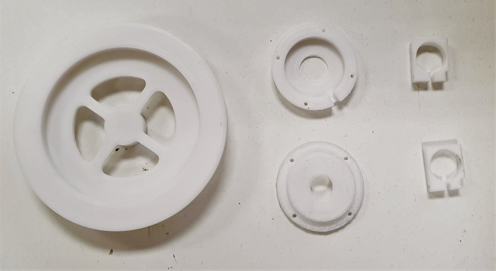
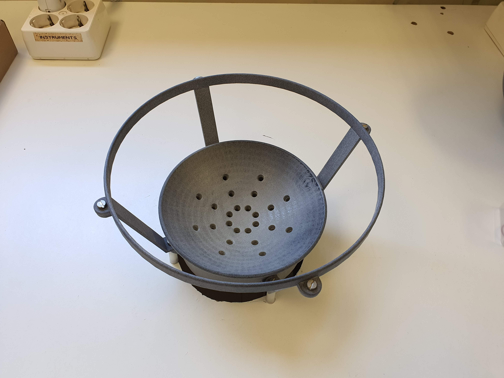
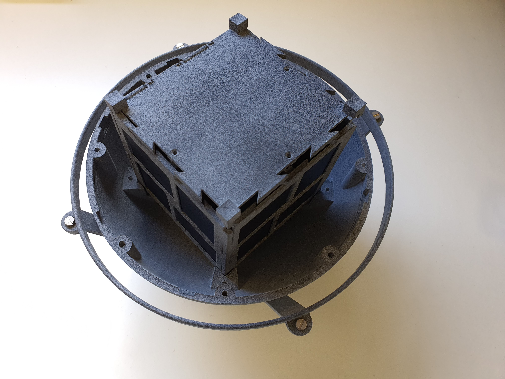
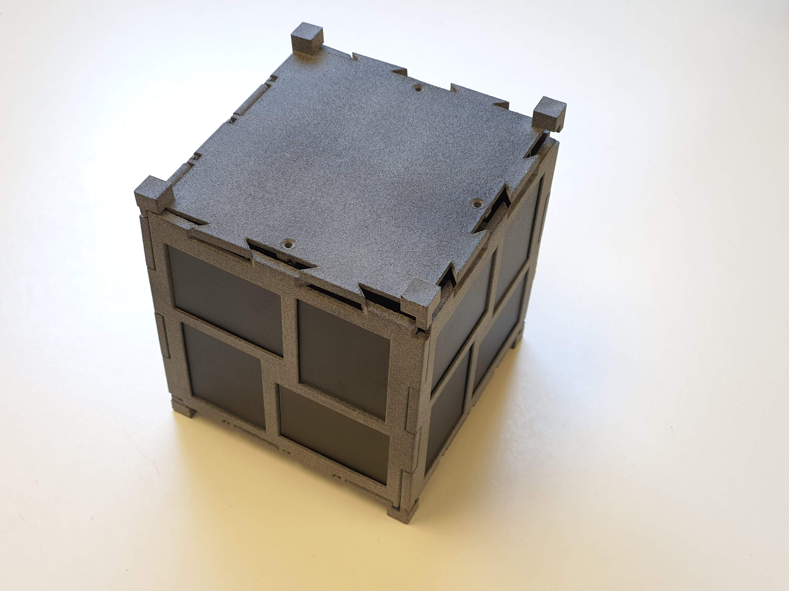

# Control algorithm for 1DOF attitude control of a 1U CubeSat

BSc. Thesis of Aerospace Engineering of Yi Qiang Ji Zhang within PLATHON project of ESEIAAT, Technical University of Catalonia.

Reaction Wheels team:
· Adria Pérez
· Olivier Bablon

## Abstract
The following project is undertaken within PLATHON (PLATform of Optical communications in Nanosatellites) project in DISEN} and TIEG Research Group lead by Dr. David González and Dr. Javier Gago in the ESEIAAT (Escola Superior d'Enginyeries Industrial, Audiovisual i Aeronàutica de Terrassa) School of the Technical School of Catalonia - BarcelonaTech.
    
PLATHON's main mission is to simulate a Networks System of CubeSats that collect information and communicate with other different orbital group satellites using IoT sensors to retrieve the information towards a ground station minimizing delay and maximizing global coverage. Final year degree and master students from several departments are the main contributors to the project and most of the system components are designed and built by students.
    
The project's overview encompasses an analytical estimation of the worst-case disturbance torques calculations for the mission. Moreover, a detailed control algorithm is developed for fine pointing and coarse pointing modes in the orbit as well as a 3D real-time monitoring interface. Finally, the design of the Reaction Wheel (RW) is also made following the technical requirements set by the project specifications.
    
The final stage of the project focuses on the testing and simulation of the implemented control algorithms. To perform the simulation, the CubeSat is introduced in an Air bearing in the centre of a magnetic simulator, which will generate a magnetic field similar to the conditions that the satellite will be subjected in a Low Earth Orbit (LEO). 
The Onboard Computer (OBC) of the nanosatellite communicates via Bluetooth with the ground computer waiting for commands. The ground station has full access to the satellite's attitude and full control over the distinct modes of the satellite (i.e. Detumbling mode, Pointing mode, Normal mode, among others). Once the magnetic field and other sources of disturbances are set, the reaction wheels and magnetorquers will activate to control the CubeSat's attitude. Analogously, this attitude data measured by the Inertial Measurement Unit (IMU) of the Attitude Determination and Control Subsystem (ADCS) is sent back to the ground station's computer and further displayed with a computer-generated 3D model in real-time. The CubeSat is intended to be powered with both solar panels or a LiPo battery. Running a software-in-the-loop and a hardware-in-the-loop test has shown that the system requires some modifications to achieve more precise results.

### CubeSat assembly with all the components

### CubeSat PCB

### Reaction Wheel

### Air Bearing

